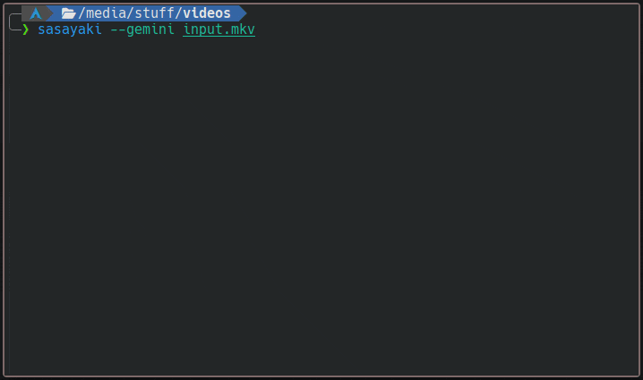

# Sasayaki

A small CLI tool that simplifies and automates the process of installing and using AI models to transcribe and translate videos. Written in Go, it uses [**faster-whisper**](https://github.com/SYSTRAN/faster-whisper) or [**whisper.cpp**](https://github.com/ggerganov/whisper.cpp) for transcription and english translation. Translation into other languages is done using **Google Gemini**. Just enter the video link or file path to get translated subtitles in .srt format.

The core features of both implementations download, install and works automatically, and the models run on the CPU by default without requiring any additional system dependencies. Both faster-whisper and whisper.cpp can perform better on GPUs, but this requires manual installation of dependencies and editing the Python script for faster-whisper or manually compiling binaries for whisper.cpp. I plan to add GPU support in the future, but currently, I do not have a dedicated GPU, so I am unable to test and debug GPU functionality. Fortunately, both implementations are fast enough that on a moderately powerful CPU, the medium or small models perform sufficiently well.



Why does this tool exist when there are many similar ones? Because none of them met my requirements, so I wrote a simple script for myself. Since it works quite well, I decided to refine it slightly and make it available for others. It's just ~700 lines of Go and Python, and I also learned the basics of Golang while creating it. Most moderately advanced users would be able to do it on their own, but I hope it helps someone new or saves someone a bit of time.

The name Sasayaki (ささやき) means "whisper" in Japanese.

## Requirements

For now, this tool only works on Unix-like systems. Only Linux tested and only the binaries for Linux are available for download. It requires these packages to be installed:

-   [ffmpeg](https://www.ffmpeg.org/)
-   [yt-dlp](https://github.com/yt-dlp/yt-dlp) (optional)

faster-whisper version requires also:

-   [python](https://www.python.org/)
-   [pyenv](https://github.com/pyenv/pyenv)

whisper.cpp version requires also:

-   [curl](https://curl.se/) (it should be installed by default on most systems)

## Installation

Download the latest executable from the [Releases](https://github.com/patryk-ku/sasayaki/releases) page. Then, grant the file execute permissions:

```sh
chmod +x sasayaki
```

There are two installation options:

### faster-whisper version (requires python)

```sh
./sasayaki --install
```

### whisper.cpp version

```sh
./sasayaki --install --cpp
```

You can install both at the same time:

### both versions

```sh
./sasayaki --install; ./sasayaki --install --cpp
```

> [!NOTE]
> The `--install` parameter will create a `.sasayaki` folder in your home directory, next it will install python 3.12 using pyenv, then create a separate venv and download the necessary packages in it. Finally, it will create the python file needed for transcription and a configuration file. If you chose the whisper.cpp version, all Python-related elements will be skipped, and an executable file named whisper-cli will be created in the program directory. You can reverse this process with `--uninstall` or manually delete the `.sasayaki` folder, but **this will not uninstall a previously installed version of Python from pyenv, you have to do it manually**.

Optional:

-   Open `config.toml` and insert here your Gemini API key.
-   Set cpu threads and model size in `config.toml`
-   Add `sasayaki` binary to PATH
-   _(advanced)_ Edit `transcribe.py` to enable running model on GPU (look for commented lines)
-   _(advanced)_ Compile whisper.cpp yourself with the parameters that enable GPU acceleration and replace whisper-cli in the program directory with your own executable

## Usage

```sh
./sasayaki [args] <url>
```

Possible urls:

-   yt-dlp compatibile url
-   local video or audio file
-   .srt file created by this program (file name must end with " (transcription).srt")

Available args:

```
  --config
        Use to create or reset config file
  --cpp
        Transcribe using whisper.cpp instead of faster-whisper
  --debug
        Print debug info in stdout
  --gemini
        Translate using Google Gemini instead of Whisper
  --install
        Use to install program and needed dependencies in user home folder
  --lang <string>
        Specifies a target translation language when using Google Gemini (default "english")
  --uninstall
        Use to remove program files and its dependencies from user home folder
  --verbose
        Print commands output in stdout
  --ytdlp
        Download remote video using yt-dlp
```

> [!NOTE]
> The first use of each model (small, medium, large-v3, etc.) requires downloading it. This will happen automatically when the model is selected in the configuration file and transcription is started. The faster-whisper and whisper.cpp models are not compatible with each other and must be downloaded separately. The medium model is approximately 1.4 GiB, while the small model is 461 MiB.

Examples:

```sh
# Create english subtitles using only faster-whisper
sasayaki input.mp4

# Create english subtitles using only whisper.cpp
sasayaki --cpp input.mp4

# Create english subtitles using faster-whisper and Google Gemini
sasayaki --gemini input.mp4

# Translate into different language (only with Gemini)
sasayaki --gemini --lang japanese input.mp4

# Download video with yt-dlp then translate it
# The result is a single video file with embedded subtitles.
sasayaki --ytdlp 'example.com/input.mp4'

# There is no need to use --ytdlp for urls starting with "https://" or "http://".
sasayaki 'https://example.com/input.mp4'

# Translate .srt file into another language using Gemini.
# The file name must end with " (transcription).srt"
sasayaki --gemini --lang korean 'input (transcription).srt'
```

> [!WARNING]
> Each time you use the command with the same video file or link, previously created files will be overwritten.

## Compile from source

If you want to use whisper.cpp, you must compile it yourself and then copy the `whisper-cli` binary into the `embed` folder.

```sh
go mod tidy
go build -ldflags "-w -s"
```

## External Licenses

This project includes a compiled binary file from the [whisper.cpp](https://github.com/ggerganov/whisper.cpp) project, which is licensed under the MIT license. The full text of the MIT license can be found in the [LICENSE](https://github.com/ggerganov/whisper.cpp/blob/master/LICENSE) file in the whisper.cpp repository.
